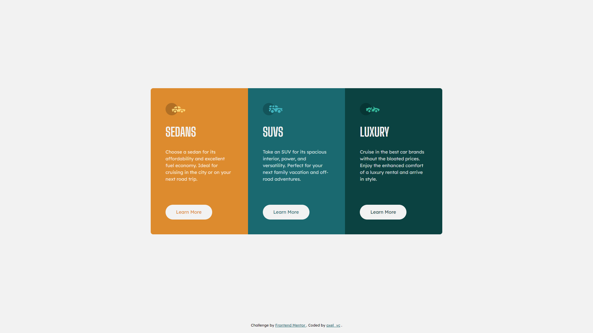

# Frontend Mentor - 3-column preview card component solution

This is a solution to the [3-column preview card component challenge on Frontend Mentor](https://www.frontendmentor.io/challenges/3column-preview-card-component-pH92eAR2-). Frontend Mentor challenges help you improve your coding skills by building realistic projects.

### Live site

https://frontendmentor-solved.netlify.app/3-column-preview-card-component

### Screenshot

## Contact

- Github - [axel_vc](https://www.your-site.com)
- Twitter - [@axel\_\_vc](https://twitter.com/axel__vc)
