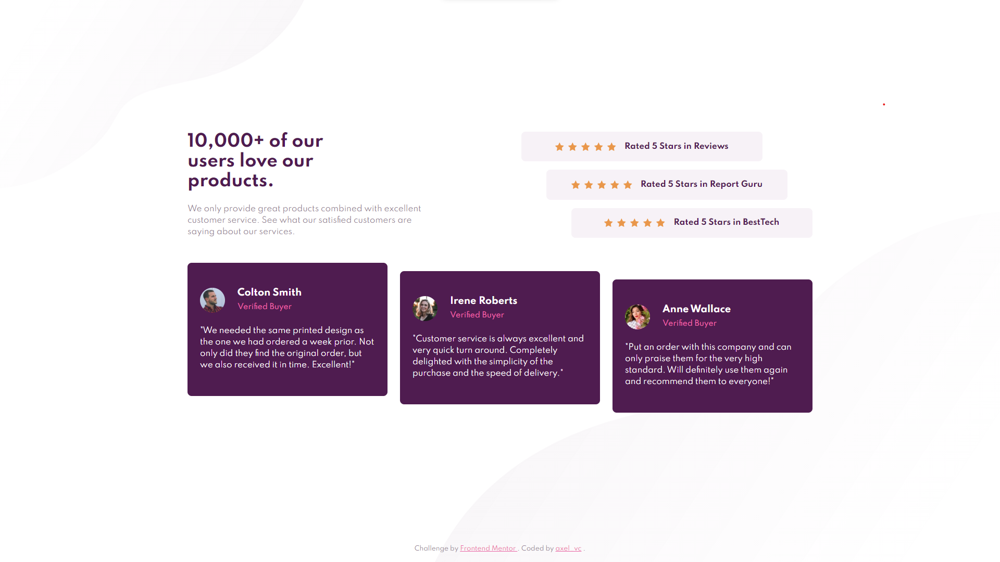

# Frontend Mentor - Social proof section solution

This is a solution to the [Social proof section challenge on Frontend Mentor](https://www.frontendmentor.io/challenges/social-proof-section-6e0qTv_bA). Frontend Mentor challenges help you improve your coding skills by building realistic projects.

### Live site

https://frontendmentor-solved.netlify.app/social-proof-section

### Screenshot

## Contact

- Github - [axel_vc](https://www.your-site.com)
- Twitter - [@axel\_\_vc](https://twitter.com/axel__vc)
